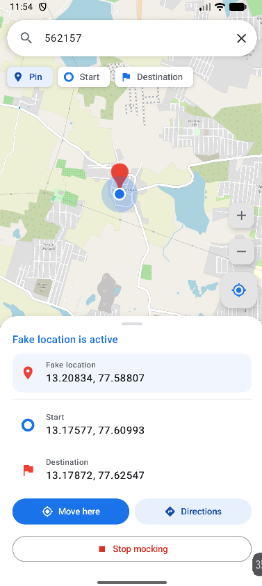
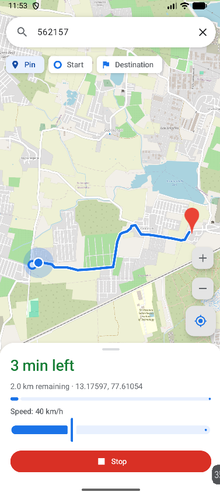
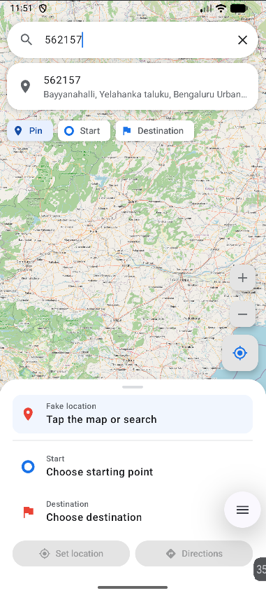

# fakeGPS

An Android app for setting a mock GPS location or simulating a driving route at a selected speed.

## Features

* Select a location on the map or search for a place or Indian PIN code.
* Set a fixed mock GPS location.
* Create and simulate driving routes.
* Adjust simulation speed.
* View route progress and estimated time.
* Stop an active simulation from the notification.

## Requirements

* Android Studio
* Android SDK 37
* Android 8.0 (API 26) or later

## Build & Run

1. Open the project in Android Studio.
2. Sync Gradle and build the `app`.
3. Install the app on a device or emulator.
4. Enable **Developer options**.
5. Select **fakeGPS** under **Mock location app**.
6. Grant the required permissions.
7. Select a location and tap **Set location**.

For route simulation, select a start and destination, tap **Directions**, choose a speed, and tap **Start**.

## Map & Routing

fakeGPS uses free public services:

* **OpenStreetMap** — map data and tiles
* **Nominatim** — place and PIN-code search
* **OSRM** — driving routes

### Contact Email

The app includes:

`app/src/main/res/raw/contact_emails.json`

Add a valid contact email before using the public OpenStreetMap/Nominatim services.

```json
{
  "email": "your-email@example.com"
}
```

The email is used to identify the application when accessing the public services and provides a contact address for service operators.

Please follow the usage policies and rate limits of OpenStreetMap, Nominatim, and OSRM. For production or high-volume usage, use a dedicated service or your own infrastructure.

## Note

Mock locations are an Android developer feature. Some apps may detect or reject mock locations. Use fakeGPS for development and testing.

## Screenshot





